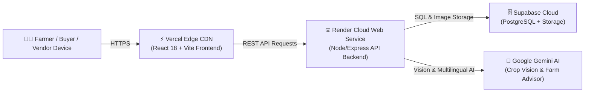

# 🚀 AgroDex: Production Publishing & Deployment Guide (Step 8)

This comprehensive guide details the step-by-step process for deploying the **AgroDex Agricultural Super-Platform** to production on **Render** (Node/Express API backend) and **Vercel** (React Vite static frontend).

---

## 🏗️ Architecture Overview



---

## 📦 Part 1: Deploy Backend API on Render

### Step 1: Sign in to Render
1. Navigate to **[render.com](https://render.com)**.
2. Click **Sign In** or **Get Started** and select **Continue with GitHub**.

### Step 2: Create a New Web Service
1. In the Render Dashboard, click the blue **+ New** button in the top-right corner.
2. Select **Web Service**.
3. Choose **Build and deploy from a Git repository** and click **Next**.
4. In the repository list, find your AgroDex repository (e.g., `CropPilotAI` or `agriconnect-ai`) and click **Connect**.

### Step 3: Configure Deployment Settings
Fill out the configuration fields with the following exact settings:

| Setting | Value | Notes |
| :--- | :--- | :--- |
| **Name** | `agrodex-backend` | Or any unique service name |
| **Region** | **Singapore (Asia Southeast)** or **Frankfurt** | Choose the region closest to India |
| **Branch** | `main` | Production deployment branch |
| **Root Directory** | `backend` *(or `server`)* | Both work seamlessly |
| **Runtime** | `Node` | Standard Node.js environment |
| **Build Command** | `npm install` | `"postinstall": "npm run build"` compiles TypeScript automatically |
| **Start Command** | `npm start` | Executes `node dist/server.js` |
| **Instance Type** | **Free** | ₹0 / month free tier |

### Step 4: Inject Environment Variables
Scroll down to the **Environment Variables** section. Click **Add Environment Variable** for each key-value pair below:

```ini
NODE_ENV=production
PORT=5000
JWT_SECRET=your_jwt_secret_key_here
JWT_EXPIRES_IN=7d
GEMINI_API_KEY=your_gemini_api_key_here
SUPABASE_URL=https://yxdbvpzxkfptxoitselr.supabase.co
SUPABASE_ANON_KEY=your_supabase_anon_key_here
SUPABASE_SERVICE_ROLE_KEY=your_supabase_service_role_key_here
```

> [!TIP]
> You can also click **Add from .env** and paste the entire block above directly.

### Step 5: Trigger Deployment
1. Click **Deploy Web Service** at the bottom of the page.
2. Render will clone the repository, run `npm install`, compile TypeScript (`tsc`), and start the Express server.
3. Once the deployment finishes, the status will show **Live**.
4. **Copy your live backend URL** displayed beneath the service title (e.g., `https://agrodex-backend.onrender.com`).

### Step 6: Verify Backend Health
Open a new browser tab and navigate to:
```
https://<YOUR-RENDER-BACKEND-URL>.onrender.com/api/health
```
You should see:
```json
{
  "status": "ONLINE",
  "app": "AgroDex Backend API",
  "version": "1.0.0"
}
```

---

## ⚡ Part 2: Deploy Frontend on Vercel

### Step 1: Sign in to Vercel
1. Navigate to **[vercel.com](https://vercel.com)**.
2. Click **Log In** or **Sign Up** and choose **Continue with GitHub**.
3. Complete account authentication if prompted.

### Step 2: Import Project Repository
1. On the Vercel Dashboard, click **Add New...** → **Project**.
2. Locate your project repository (e.g., `CropPilotAI` or `agriconnect-ai`) in the list.
3. Click **Import** next to the repository.

### Step 3: Configure Project Settings
In the **Configure Project** setup screen:

1. **Project Name**: `agrodex` (or your preferred name).
2. **Framework Preset**: Select **Vite** from the dropdown.
3. **Root Directory**:
   - Click the **Edit** button next to **Root Directory**.
   - Select `frontend` *(or `client`)* and click **Continue**.
4. **Build and Output Settings**:
   - Build Command: Leave default (`npm run build` / `vite build`).
   - Output Directory: Leave default (`dist`).
   - Install Command: Leave default (`npm install`).

### Step 4: Inject Frontend Environment Variables
Expand the **Environment Variables** section and add the following keys:

| Key | Value | Description |
| :--- | :--- | :--- |
| `VITE_API_URL` | `https://<YOUR-RENDER-BACKEND-URL>.onrender.com` | **Critical**: Paste your Render backend URL from Part 1 |
| `VITE_SUPABASE_URL` | `https://yxdbvpzxkfptxoitselr.supabase.co` | Supabase Cloud API URL |
| `VITE_SUPABASE_ANON_KEY` | `sb_publishable_2iL1pAVDMunWXz2rFFgqPw_C9R384xs` | Supabase Public Anonymous Key |

> [!NOTE]
> The frontend's `main.tsx` automatically detects whether your `VITE_API_URL` has a trailing slash or `/api` and routes all API calls seamlessly with zero configuration.

### Step 5: Deploy Application
1. Click **Deploy**.
2. Vercel will install dependencies, run `tsc && vite build`, and deploy the production bundle to its edge network in ~30–45 seconds.
3. Click **Continue to Dashboard** or the **Visit** preview to open your live application!

---

## 🛠️ Troubleshooting & Pre-Deployment Verification

### 1. Zero Direct Server Imports
Vercel only installs packages listed in `frontend/package.json`. The frontend code is 100% self-contained and makes pure REST fetch calls to the backend API.

### 2. Single Page Application (SPA) 404 Reload Protection
We have included `frontend/vercel.json` with the following rewrite rule:
```json
{
  "rewrites": [
    {
      "source": "/(.*)",
      "destination": "/index.html"
    }
  ]
}
```
This ensures refreshing pages like `/orders`, `/marketplace`, or `/vendor-portal` never returns a 404 error.

### 3. Automatic TypeScript Compilation on Render
Render's default build command is `npm install`. To ensure the server doesn't fail with `Cannot find module 'dist/server.js'`, `backend/package.json` includes:
```json
"scripts": {
  "build": "tsc",
  "postinstall": "npm run build",
  "start": "node dist/server.js"
}
```
When Render runs `npm install`, TypeScript automatically compiles into `dist/server.js`.

### 4. Render Free Tier Cold Starts
Render free web services spin down after 15 minutes of inactivity. When a user first opens the app after inactivity, the first API request may take ~30–50 seconds to boot up. Subsequent requests are instantaneous.

---

## 🧪 Post-Deployment Live Verification Checklist

Once both services are deployed, test the following key flows on your live Vercel URL:

- [ ] **Role Switcher**: Click the top-bar role selector and switch between **Farmer**, **Produce Buyer**, **Agri Shop Vendor**, and **Platform Overseer**.
- [ ] **Multilingual Support**: Change the language dropdown to **తెలుగు (Telugu)** and **हिंदी (Hindi)** to verify dynamic dictionary rendering.
- [ ] **AI Disease Diagnosis**: Upload a plant photo under **Scan Crop** and verify the Gemini AI diagnosis and Supabase storage URL.
- [ ] **Daily APMC Mandi Rates**: Open **Mandi Prices**, change the district dropdown (e.g. *Anantapur*, *Sri Sathya Sai*, *Kurnool*), and verify prices across all 8 commodity categories.
- [ ] **Agri Store Booking & 24h SLA**: In **Agri Store**, reserve certified inputs using **"Agri Store Booking Request"** (zero online debit) and view the active 24-hour countdown timer in **My Farm Orders**.
- [ ] **Merchant Acceptance**: Switch to the **Vendor Portal** under **Store Bookings Desk** to accept the booking and generate the 4-digit Collection OTP.
